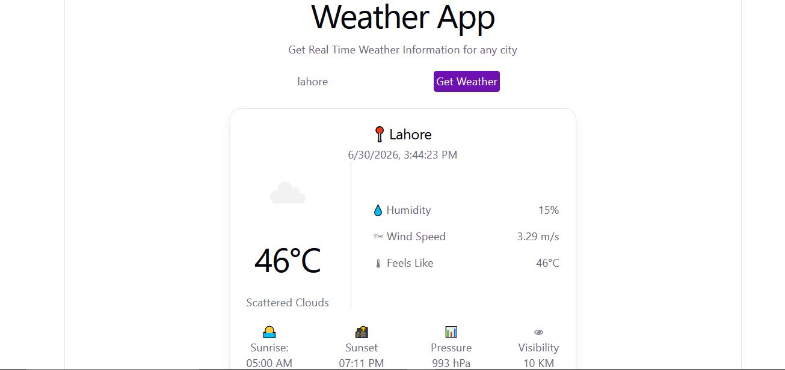

# 🌤️ Weather App

A real-time weather application built with React, TypeScript, and Vite. Get instant weather information for any city in the world using the OpenWeatherMap API.

## 📸 Screenshot



## ✨ Features

- **City Search**: Search for weather information by entering any city name
- **Real-Time Weather Data**: Get current weather conditions powered by OpenWeatherMap API
- **Detailed Weather Information**: 
  - Current temperature in Celsius
  - Weather description and conditions
  - Humidity percentage
  - Wind speed
  - Sunrise and sunset times
  - Date and time information
- **Weather Icons**: Visual weather condition icons for quick recognition
- **Loading States**: User-friendly loading indicator while fetching data
- **Error Handling**: Clear error messages for invalid cities or API issues
- **Responsive Design**: Beautiful UI built with Tailwind CSS that adapts to different screen sizes
- **Fast Development**: Powered by Vite for rapid development and hot module replacement

## 🛠️ Tech Stack

- **React 19** - UI library
- **TypeScript** - Type safety and better development experience
- **Vite** - Modern build tool and dev server
- **Tailwind CSS** - Utility-first CSS framework
- **OpenWeatherMap API** - Real-time weather data
- **ESLint** - Code quality and linting

## 📦 Getting Started

### Prerequisites
- Node.js (v16 or higher)
- npm or yarn package manager

### Installation

1. Clone the repository or navigate to the project folder:
```bash
cd weather-app
```

2. Install dependencies:
```bash
npm install
```

3. Start the development server:
```bash
npm run dev
```

The application will be available at `http://localhost:5173`

## 🚀 Available Scripts

- `npm run dev` - Start the development server with hot reload
- `npm run build` - Build the project for production
- `npm run preview` - Preview the production build locally
- `npm run lint` - Run ESLint to check code quality

## 📋 Project Structure

```
src/
├── components/
│   ├── SearchBar.tsx          # City search input component
│   ├── WeatherCard.tsx        # Weather display card component
│   ├── Loading.tsx            # Loading indicator component
│   ├── ErrorMessage.tsx       # Error message display component
│   └── WeatherCard.css        # Weather card styling
├── services/
│   └── weatherApi.js          # OpenWeatherMap API integration
├── App.tsx                    # Main application component
├── main.tsx                   # Application entry point
├── index.css                  # Global styles
└── App.css                    # App-level styles
```

## 🎯 How to Use

1. Open the application in your browser
2. Enter a city name in the search bar
3. Click the "Get Weather" button or press Enter
4. View the real-time weather information for that city
5. Search for another city anytime to get updated weather data

## 🔌 API Integration

This application uses the free OpenWeatherMap API to fetch real-time weather data. The API key is already configured in the project.

## 📱 Features Details

### Search Bar
- Text input for city name
- Submit button (disabled when input is empty)
- Form validation to prevent empty searches

### Weather Card
- City name with pin emoji
- Current date and time
- Weather icon corresponding to conditions
- Temperature in Celsius
- Weather description
- Humidity level
- Wind speed
- Atmospheric pressure
- Sunrise and sunset times

### User Experience
- **Loading State**: Shows spinner while fetching data
- **Error Handling**: Displays user-friendly error messages for invalid inputs or API errors
- **Responsive Layout**: Optimized for desktop and mobile devices

## 🎨 Styling

The application uses Tailwind CSS for styling, providing:
- Modern, clean UI design
- Responsive grid and flexbox layouts
- Smooth colors and shadows
- Professional appearance with rounded corners and borders

## 💡 Future Enhancements

- Add weather forecast for multiple days
- Implement geolocation-based weather
- Add temperature unit toggle (Celsius/Fahrenheit)
- Store search history
- Add dark mode theme
- Weather alerts and warnings

## 📝 License

This project is open source and available for educational purposes.
import reactX from 'eslint-plugin-react-x'
import reactDom from 'eslint-plugin-react-dom'

export default defineConfig([
  globalIgnores(['dist']),
  {
    files: ['**/*.{ts,tsx}'],
    extends: [
      // Other configs...
      // Enable lint rules for React
      reactX.configs['recommended-typescript'],
      // Enable lint rules for React DOM
      reactDom.configs.recommended,
    ],
    languageOptions: {
      parserOptions: {
        project: ['./tsconfig.node.json', './tsconfig.app.json'],
        tsconfigRootDir: import.meta.dirname,
      },
      // other options...
    },
  },
])

```
